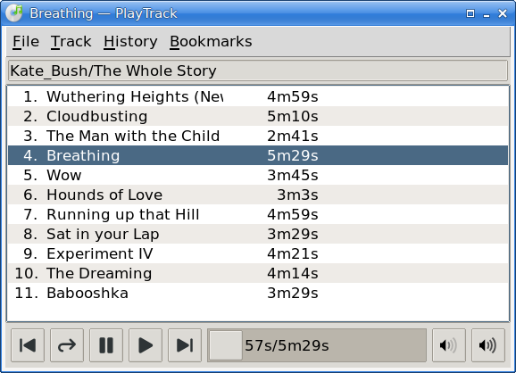

# PlayTrack

PlayTrack is a GUI audio track player.

**Superceded by [Playlists](https://github.com/mark-summerfield/playlists)
which provides far more functionality.**

PlayTrack is a demonstrator for a simple Tcl wrapper (`mplayer-1.tm`) that
uses the _mplayer_ in “slave” mode. It is fine for playing individual tracks
and supports a history and bookmarks (a max. of 26 tracks each), but has no
support for playlists.

Note: I use [Store](https://github.com/mark-summerfield/store) for version
control so github is only used to make the code public.

## Dependencies

Tcl/Tk >= 9.0.2; Tcllib >= 2.0; Tklib >= 0.9; mplayer executable (which must
be in the `$PATH`).

## License

GPL-3

---
